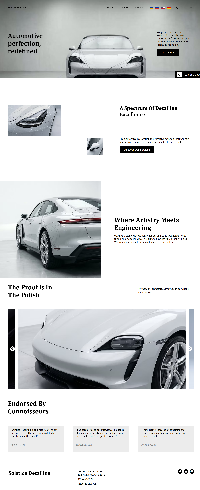

# 🚗 Detailing

A modern and responsive car detailing website built with React.

## 🌐 Live Demo

https://ArturMk099-dev.github.io/Detailing/

---

## 📖 About

Detailing is a modern car detailing website developed with React. The project features a responsive design, multilingual support, smooth animations, and an interactive image slider, providing a clean and user-friendly experience on all devices.

---

## ✨ Features

- 🚗 Modern UI Design
- 📱 Fully Responsive
- 🌍 Multi-language Support (English, Russian, Armenian, German)
- 🎞️ Interactive Image Slider
- ✨ Smooth Scroll Animations
- 📷 Gallery
- 📞 Contact Form
- ⚡ Fast Performance

---

## 🛠️ Built With

- React
- JavaScript (ES6+)
- HTML5
- CSS3
- React Router DOM
- i18next
- react-i18next
- React Slick
- Slick Carousel

---

## 🚀 Getting Started

Clone the repository

```bash
git clone https://github.com/ArturMk099-dev/Detailing.git
```

Install dependencies

```bash
npm install
```

Start development server

```bash
npm start
```

Create production build

```bash
npm run build
```

Deploy to GitHub Pages

```bash
npm run deploy
```

---

## 📸 Preview



---

## 📂 Project Structure

```
Detailing/
│
├── public/
├── src/
│   ├── assets/
│   ├── components/
│   ├── hooks/
│   ├── locales/
│   ├── pages/
│   ├── App.js
│   └── index.js
│
├── README.md
├── preview.png
└── package.json
```

---

## 🌍 Languages

- 🇺🇸 English
- 🇷🇺 Russian
- 🇦🇲 Armenian
- 🇩🇪 German

---

## 📱 Responsive Design

- ✅ Mobile
- ✅ Tablet
- ✅ Laptop
- ✅ Desktop

---

## 🔗 GitHub Repository

https://github.com/ArturMk099-dev/Detailing

---

## 👨‍💻 Author

**Artur Mkrtchyan**

GitHub: https://github.com/ArturMk099-dev

⭐ If you like this project, consider giving it a star!